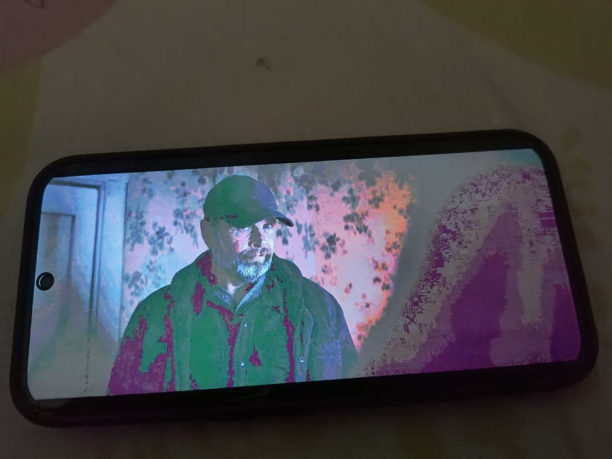

+++
title = 'My experience with a Nothing phone'
date = 2025-07-21
description = "My 6 month experience using the Nothing Phone (2a Plus), including the green tint AMOLED display issue"
tags = ["nothing-phone", "amoled-display", "green-tint"]
heroImage = "../../assets/post1/green-purple-tint1.jpeg"
+++

# My Experience With the Nothing Phone (2a Plus)

So I bought Nothing Phone (2a Plus) 6 months ago and it was my first AMOLED mobile phone,
everything looked perfect, the stock Android experience the glyph interface and the dot matrix design, really attracted me. 

Little did I know the phone had a major defect with it's display being not able to display gray color perfectly and showing red/green/purplish tint instead.

I did some digging and found out it was normal for AMOLED displays but for this smartphone it was really bad, I can really see greenish tint all over at night when I use phones at low brightness.
I first time saw it while opening Quick Settings from lockscreen.

I contacted Nothing support and explained the issue.
Their response was that this behavior is normal for OLED displays. They suggested visiting nearest service center if I worry too much.
But I have read that even if they have got the display replacement somehow the issues are not still not gone.

## TLDR: 

The Nothing Phone (2a Plus) has a nice design and clean software, but in my experience the display quality was disappointing.
Not every unit may have this problem, but it seems common enough that buyers should check the display carefully, especially at low brightness and during dark scenes.

I have included some sample images...

