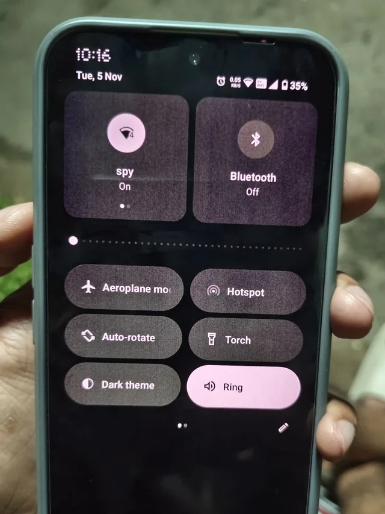
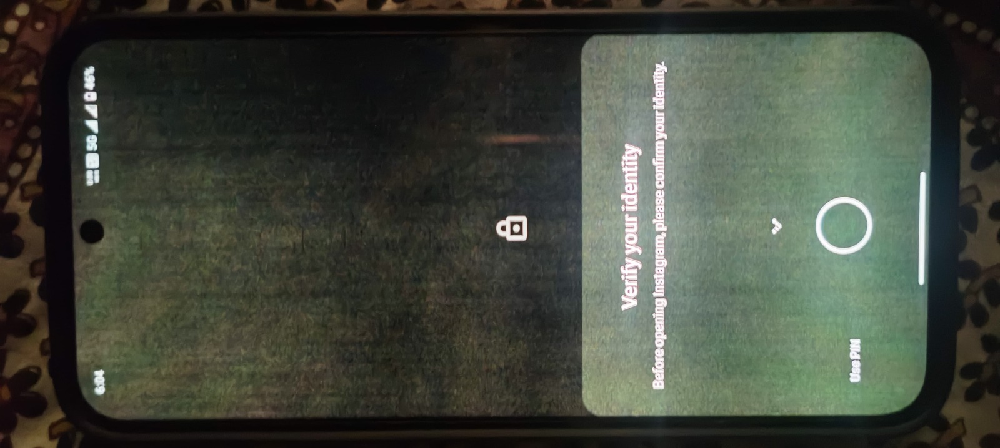

+++
title = "Nothing Phone (2a Plus) Display Issue: My 6 Month Experience"
date = 2025-07-21
description = "My 6 month experience using the Nothing Phone (2a Plus), including the green tint AMOLED display issue and why I eventually sold the phone."
tags = ["nothing-phone", "amoled-display", "green-tint"]
heroImage = "../../assets/post1/green-purple-tint1.jpeg"
+++

# My Experience With the Nothing Phone (2a Plus)

I used the Nothing Phone (2a Plus) for about 6 months. It was also my first phone with an AMOLED display, so at the time I didn’t really know about the quirks that sometimes come with OLED panels.

When I first bought the phone everything looked perfectly normal. The display looked vibrant and I didn’t notice anything unusual during the first few days.

After about 4 or 5 days, something strange happened.

## The first time I noticed the issue

One night I opened the camera in a very dark room and the display suddenly looked grainy with green colors across the screen.

For a moment I thought the camera sensor was damaged. But when I moved to a brighter area everything looked normal again.

That made me curious, so I immediately started searching online to understand what was happening.

Most results said that AMOLED displays can sometimes show green or purple tint, especially at very low brightness levels. At first I assumed that was the explanation.

But when I compared my phone with a friend’s phone, his display didn’t show the same exaggerated tint.

That’s when I started to suspect something might actually be wrong with my device.

## Strange colors in dark scenes

While testing the display, I played some OLED demo videos that are usually used to showcase screen quality.

In some dark parts of the video, my display showed weird green and purple colors. When I played the same video on my friend’s phone, it looked completely normal.

So the issue didn’t seem like a normal OLED behavior anymore.

## Problems at low brightness

The problem became much more obvious at night when the brightness was set very low.

Sometimes the entire screen would turn slightly greenish. In some situations I even noticed distorted green pixel lines, especially when opening the notification panel on the lock screen.

After reading a lot of discussions online, I found that some displays struggle to render extremely dark color shades correctly. Colors very close to black, such as #030303, can sometimes cause tinting on lower quality OLED panels.

This seemed to match what I was seeing.

## Fingerprint sensor struggles

Another issue I noticed was with the in-display fingerprint sensor. Many times it took three or four attempts to unlock the phone.

Since the fingerprint reader relies on the display to scan the finger, I suspect the display quality might have affected it as well.

## The software update

At some point Nothing released a software update that changed the lock screen shade to pure black.

This likely hides the green tint because OLED pixels turn completely off when displaying black. While it makes the issue less visible, it doesn’t actually solve the underlying problem.

## Contacting support

I contacted Nothing support and explained the issue.

Their response was that this behavior is normal for OLED displays. They suggested visiting a service center if I was still concerned.

From reading other users’ experiences online, some service centers acknowledge the issue while others say everything is normal. Even when a display replacement is done, many people report getting another panel with the same problem.

Out of warranty the display replacement costs around 7000 INR, which is quite expensive.

## Why I sold the phone

One of the main reasons I bought the phone was to watch HDR movies. Unfortunately the tint issue made dark scenes look strange and sometimes distracting.

Eventually I decided to sell the phone on OLX and managed to get around 15000 INR for it.

After that I bought a refurbished iQOO Z9 from the official iQOO website for about 11000 INR. The phone arrived almost like new, and since switching I haven’t seen the same exaggerated green or purple tint problems.

## Final thoughts

The Nothing Phone (2a Plus) has a nice design and clean software, but in my experience the display quality was disappointing.

Not every unit may have this problem, but it seems common enough that buyers should check the display carefully, especially at low brightness and during dark scenes.

